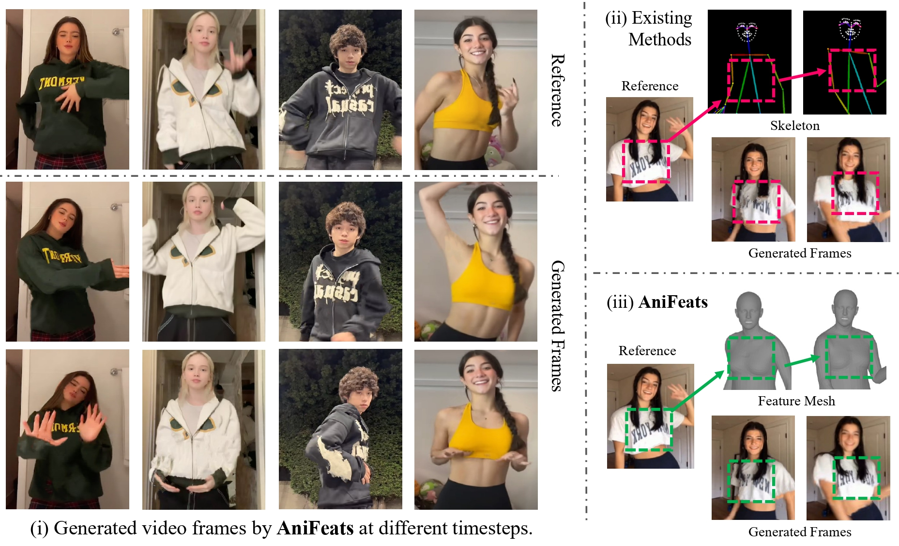

# AniFeats: Animate 3D Feature Meshes for Character Video Generation

[Beijia Lu](https://beijia11.github.io/), 
[Zekai Gu](https://scholar.google.com/citations?user=Y8AU3RkAAAAJ&hl=en), 
[Zhiyang Dou](https://frank-zy-dou.github.io/),
[Haotian Yuan](https://github.com/dozingbear),
[Chenyang Si](https://chenyangsi.top/), 
[Yukang Cao](https://yukangcao.github.io/),
[Yuming Jiang](https://yumingj.github.io/),
[Yuan Liu](https://liuyuan-pal.github.io/),
[Wenping Wang](https://engineering.tamu.edu/cse/profiles/Wang-Wenping.html),
[Ziwei Liu](https://liuziwei7.github.io/)

  

Our code and models will be publicly available at [GitHub](https://github.com/Beijia11/AniFeats) after acceptance.  

